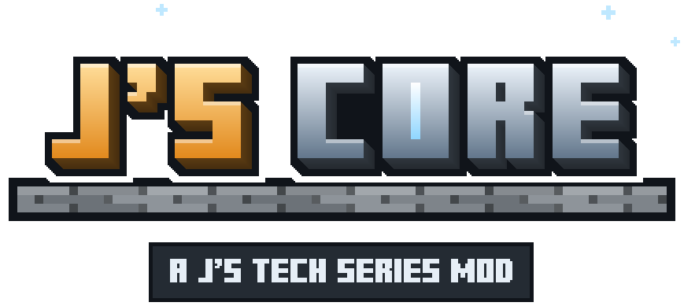

# J's Core

The shared library of the [J's Tech Series](../README.md), and a general-purpose library for building
technology mods: the series is built on it, and any mod may use it. Its id is `jscore`, and every mod of the
series requires it at the same version. It adds nothing to play on its own beyond the materials every mod
trades and the shared cable block each mod lays its cables in (the series' technical reference is on its way):
install it because another mod asks for it, or because your own project builds on it (see
[Using the Core in your project](#using-the-core-in-your-project)). Everything in it is declared through
explicit builders.

Every part is explained from zero, with the code that uses it, in the
[J's Core documentation](docs/README.md).

## What it holds

What a technology mod needs, whichever mod it is.

### The world model

- The two axes of progression: the hardware eras (Vintage, Legacy, Transition, Standard, Advanced and the ones
  to come) and the industrial tiers (T0 to T9), kept apart on purpose.
- The material catalogue: the dusts, plates and other forms of the metals the mods process, registered
  here so that every mod trades the same items. They are the one thing the core adds to the game; the
  industrial mod shows them in its creative tab and gives them their recipes.
- Typed identities (network and node ids) and stable ids and names for everything that is saved or sent, so
  renaming an enum constant never breaks a world.

### Networks and Operations

- The data network: the node hierarchy, the topology elements, how cable runs join into networks (a
  disjoint-set index that devices can bridge), each cable's tier, and the slowest cable between any two points
  of a network, which is as fast as data can go between them.
- The Operations framework the network runs on: the Operation types a mod declares, their lifecycle and
  statuses, priorities and aging, queues, latency and progress, cancellation and failure, and the lifecycle
  events any mod can observe.
- The energy network (FE), distributed from each generator with a split that never creates or loses energy.
- The point-to-point links between a computer and its peripherals, and the capabilities a block exposes to take
  part in any of that.
- Multiblock shapes, the four rotations and their validation.

### Sound

- A sound system for every mod and addon of the series. A mod declares a sound once (where it is heard from,
  whether it loops, its channel, its files, how far it carries, its subtitle), and its registration,
  `sounds.json` entry and translatable subtitle follow from that one line.
- Channels with a volume each (machines, devices, interface, alerts, ambience, music, voice), a Sound Mixer
  screen in the game's options, a per-sound mute that reaches any sound of the game, ducking under alerts,
  visual signs for alerts, a "Turn Off Last Sound" key and debug lines on the F3 screen.
- Running sounds that follow the state of what makes them (a fan, a disk), rooms of many machines heard as
  one, occlusion by walls, and a budget of voices so the loudest and nearest are kept.
- Cues: code says what happened and a data file, which a resource pack can replace, picks the sound by the
  context it happened in (era, sound device, system).
- Sounds made as they play: a synthesiser (square, pulse, triangle, sawtooth, sine, noise, FM and
  wavetable voices), WAV and Ogg Vorbis decoding with a registry for more formats, sound devices with their own
  limits (voices, bits, sample rate, stereo, frequency response) and a voice allocator that gives a new sound
  the voice of the oldest.
- Recordings that are not the mods' own: a content-addressed store on the server, fetched by the players who
  hear them and kept in a cache on their computer, uploads from a player's own computer with a share per
  player, sessions heard from any number of places, the cover picture a recording carries, and a command
  for an operator to see and clear what the server keeps.

### Text, colour and content

- Translatable text: a sentence a player reads is declared once as a key beside the code that says it, with
  its English, and the language file is made from those declarations. Text travels between server and client
  as keys with their arguments, so each player reads it in their own language.
- Palettes: the colours a screen paints with, declared once as a record of named roles and written to
  `assets/<mod>/palettes/`, so a resource pack can recolour the screens of every mod, one role at a time.
- The way every mod declares its blocks and items: once each, with its name, look, drops, creative tab
  section and tags, from which the data generation writes the block state, the models, the English, the loot
  and the tags, so none of them is a list kept by hand. Sounds and cues are declared the same way.
- Block entities, their blocks and their menus, declared the same way: a block entity's state as fields, each
  saved, sent to the players who see the block or shown to its menu as it says, with inventories, energy and
  tanks that pipes and cables reach and that spill when the block breaks, values of any kind a codec writes,
  parts that write themselves, block state properties that follow a value, and a peripheral's link to its owner;
  a block that ticks its block entity and opens its menu; and a menu whose slots, shift-clicks, buttons and
  validity are said once, its slots placed from the screen's own layout.

### Screens and the rest

- The GUI toolkit the screens of every mod are drawn with: skins, themes by era, text with a shadow that
  suits its ground, layouts that can be tested without the game, and the
  [components](docs/UI_COMPONENTS.md) desktop programs are composed from.
- [Fonts](docs/FONTS.md): a mod declares a font with its licence and credit, the data generation turns its
  free source (a BDF bitmap font) into the font the game draws from, and a grid painter puts text on a
  monospace grid in it, drawing the box lines and blocks itself so frames and bars join. The Core carries Misc
  Fixed, the fixed font of the old Unix terminals, in three sizes (6x10, 9x15, 10x20), for any mod's terminal-like
  views.
- [Motion](docs/MOTION.md): curves written as CSS writes them, a profile of motions for each look a mod
  declares (growing, sliding, going down to a place and back, an outline travelling, a colour giving way), kept as
  a file a resource pack replaces, and one clock every motion is read against, smooth between ticks and still for a
  player who reduces motion.
- The registry of programming languages a machine can run, the configuration system (with ranges every value
  is clamped into), the series' internal event bus, persistence helpers, the payload framework and the unit
  formatter.

### Machines, the world and the rest

- [Processing machines](docs/MACHINES.md) with slots, tanks, energy, progress and upgrades; recipes of several
  items and fluids in data files; and a page in JEI and in EMI for every recipe kind.
- [Multiblocks](docs/MULTIBLOCKS.md) as data, with ports that pass pipes through to the controller.
- [The world](docs/WORLD.md): ores and structures declared for the data generation, dimensions with rules for
  gravity, air, heat, weather and pressure, dimensions made while the game runs, data over areas, and chunk
  loading by owner.
- [Ownership](docs/OWNERSHIP.md) and teams (FTB Teams when it is installed), [progression](docs/PROGRESSION.md)
  axes and advancements, and [commands](docs/COMMANDS.md) under `/jstech`.
- [Entities](docs/ENTITIES.md), vehicles, robots that work a list of tasks, projectiles, and what a player wears
  (Curios or Accessories when installed).
- [Overlays](docs/OVERLAYS.md): HUD elements that stack, holograms, and Jade's lines.
- A [settings screen](docs/SETTINGS.md) in the Core's look for every mod's settings, and a [GameTest
  kit](docs/TESTING.md).
- [Manuals](docs/MANUALS.md): each mod writes its chapter once, in entries of ready blocks, and it shows in its own
  manual and in the series' one; styles are data, a binder by default; contents, index and search are built for it,
  and holding M over an item opens its page.

## Configuration

The server's settings live in one server config, `jstech-balance.toml`, written next to the world save
(`serverconfig/`). Every key has a documented range and is clamped into it on load, so an out-of-range value
degrades a setting instead of breaking the world; the file is re-read when it changes.

| Key | Default | What it tunes |
| --- | --- | --- |
| `balance.hdd_latency_ticks`, `ssd_latency_ticks`, `nvme_latency_ticks` | 10, 3, 1 | The seek latency of each disk class before a transfer starts streaming. |
| `balance.operation_waiting_timeout_ticks` | 1200 | How long an Operation waits on a locked resource or a busy executor before it gives up. |
| `balance.operation_priority_aging_ticks` | 600 | Ticks a queued Operation waits per priority level it gains while others jump ahead; 0 disables aging. |
| `balance.subframe_efficiency_factor` | 0.6 | The share of its own capacity a Subframe lends to the Mainframe orchestrating it. |
| `balance.orphaned_operations_expiry_hours` | 24 | How long a saved, never-resumed Operation may sit before a reload discards it instead of resuming it; 0 never expires. |
| `balance.program_machine_micros` | 1000 | The real time, in microseconds, one machine may spend running its programs in a tick. |
| `balance.program_server_micros` | 8000 | The same for every machine of the server together. |
| `media.download_kilobytes_per_second` | 1024 | How fast the server sends recordings to each player. |
| `media.upload_kilobytes_per_second` | 512 | How fast each player sends a recording they bring. |
| `media.max_file_megabytes` | 32 | The largest recording a player may bring; 0 takes none from players at all. |
| `media.player_quota_megabytes` | 512 | How much the recordings one player brought may take together; 0 sets no limit. |
| `calendar.days_per_season` | 28 | How many days a season of the world's year lasts; a year is four seasons. |
| `world.chunks_per_owner` | 25 | How many chunks one player or team may keep loaded through machines, across the world. |

The same settings, and every other mod's, can be changed on the Core's settings screen, from the game's Mods list.
Each player's own sound settings (channel volumes, muted sounds, what the Sound Mixer shows) are kept on their
computer in `config/jstech-audio.json`.

## For addon authors

The Core's API, what the series promises to keep and how long, is its `api` packages and a few types named in
[docs/API.md](../docs/API.md); it is versioned (`JsCoreApi.VERSION`) and not yet settled. The library parts the
[documentation](docs/README.md) describes work and are there to be used, but may change shape between releases
until they move into the API; the changelog says so when they do. The series keeps one version across all its
mods, so an addon should require the core and the mod it extends at the same version.

Two entry points have been there longest. `JsCore.events()` is the series' event bus: the
Mainframe posts the life of every Operation on it (created, started, then completed, failed or discarded,
each carrying the network, the Operation id and its type id), on the server thread, and any mod subscribes
with core types alone. `JsCore.operations()` is the registry of Operation types the mods declare, each with
an id such as `jsc:select`, a category, an argument record and a handler that hands the request to the
orchestrator; a mod can look a type up and submit through it instead of calling the orchestrator's own
methods. The argument records of the computing types still belong to the computing mod and name its
Mainframe, so submitting takes that mod on the classpath for now; observing does not.

## Using the Core in your project

Anyone may use J's Core in their own project, whatever it is: a mod that depends on it, an addon of the
series, a modpack, open source or closed, free or paid. All that is asked is credit, for example
"Uses J's Core, by jvpts11 (https://github.com/jvpts11/js-tech-series)" in your description or credits.

The Core is released under the [GNU Lesser General Public License, version 3 only](../COPYING.LESSER), which
is what makes this possible. In plain words, what it asks of you:

- **Using the Core as it is** (as a dependency, or shipped inside your jar as a separate jar) puts no
  licence on your own code: your project stays under whatever licence you choose.
- **Keep the notices.** The Core's copyright notice and its licence travel with it; they are already inside
  its jar (`COPYING.LESSER` and `COPYING`), so shipping the jar untouched is enough.
- **Changes to the Core itself stay open.** If you change the Core's own code and hand the changed Core to
  others, those changes go out under the same licence, with their source. Copying the Core's source into
  your own code counts as changing it, so that copied part stays under the LGPL.
- **Players can swap the Core.** Whoever uses your project must be able to replace the Core it uses with
  another version, which is already the case when the Core is its own jar.

This is a summary, not the licence: where they differ, the licence text is what applies.

## Requirements

- Minecraft 1.21.1 and NeoForge 21.1.248 or newer.
